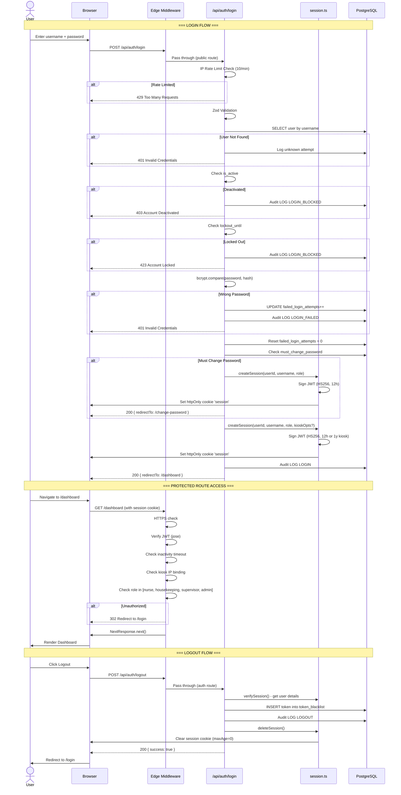

# EWTCS — Auth & Session Flow

---

## 1. Authentication Strategy

EWTCS uses a **custom JWT authentication** system (no NextAuth) with the following components:

| Component | Technology | Purpose |
|-----------|-----------|---------|
| Token Format | JWT (HS256) | Session token signed with `SESSION_SECRET` |
| Token Library | `jose` | Edge-compatible JWT signing and verification |
| Password Hashing | `bcrypt` | Secure password storage (cost factor default) |
| Token Storage | httpOnly cookie (`session`) | Prevents XSS token theft |
| Token Blacklist | `token_blacklist` DB table | Invalidation on logout |
| Input Validation | `zod` | Request body schema validation |

---

## 2. Login Flow — Step by Step

1. **User submits** username + password (+ optional `kioskMode` flag) via POST to `/api/auth/login`.
2. **IP Rate Limiting** — In-memory check: max 10 login attempts per IP per minute. Returns 429 if exceeded.
3. **Input Validation** — `zod` schema validates username and password are non-empty.
4. **User Lookup** — Query `users` table by username. Returns 401 if not found (logs as unknown attempt).
5. **Account Active Check** — If `is_active = false`, returns 403 with "Account deactivated" message. Audit logged as `LOGIN_BLOCKED`.
6. **Lockout Check** — If `lockout_until > NOW()`, returns 423 with remaining lockout time. Audit logged.
7. **Password Verification** — `bcrypt.compare()` against stored `password_hash`.
8. **Failed Login** — If password wrong:
   - Increment `failed_login_attempts`
   - If attempts ≥ 5: set `lockout_until` = NOW + 15 minutes
   - Audit log `LOGIN_FAILED`
   - Return 401
9. **Success — Reset Counters** — Set `failed_login_attempts = 0`, `lockout_until = NULL`.
10. **Temp Password Check** — If `must_change_password = true`:
    - If temp password is > 24 hours old: return 403 "Temporary password expired"
    - Otherwise: create session and redirect to `/change-password`
11. **Kiosk Mode** — If `kioskMode = true`:
    - Extract client IP
    - Create `kiosk_sessions` DB record bound to IP
    - Set JWT with `isKiosk: true, kioskIp, kioskSessionId` claims
    - Session expiry: 1 year (vs normal 12 hours)
12. **Create Session** — Sign JWT with:
    - Claims: `userId, username, role, lastActivity`
    - Algorithm: HS256
    - Expiry: configurable (default 12h, or 1y for kiosk)
13. **Set Cookie** — `session` cookie with:
    - `httpOnly: true` (no JS access)
    - `secure: true` in production
    - `sameSite: 'lax'`
    - `path: '/'`
14. **Audit Log** — Record `LOGIN` event with username, role, IP.
15. **Redirect** — Return role-based redirect URL.

---

## 3. Session Storage & Validation

### Creation (`shared/lib/session.ts — createSession()`)
- JWT signed with `jose` using `SESSION_SECRET` (HS256)
- Stored as httpOnly cookie named `session`
- Contains: `userId`, `username`, `role`, `lastActivity`, kiosk fields (optional)

### Verification (`shared/lib/session.ts — verifySession()`)
1. Read `session` cookie
2. Verify JWT signature and expiry via `jose.jwtVerify()`
3. **Inactivity Check**: If `Date.now() - lastActivity > INACTIVITY_TIMEOUT_MS` (default 30 min) → session expired (kiosk sessions exempt)
4. **Sliding Renewal**: On valid activity, re-sign JWT with fresh `lastActivity` and extended expiry
5. Return session payload or `null`

### Active Session Verification (`shared/lib/active-session.ts`)
- Extends `verifySession()` with a **database check** — verifies the user still exists, is active, and (for kiosk) the kiosk session hasn't been revoked
- Used by API routes that need stronger validation beyond JWT

### Deletion (`shared/lib/session.ts — deleteSession()`)
- Clears the `session` cookie by setting `maxAge: 0` and `expires: new Date(0)`

---

## 4. Role-Based Access Control

### Roles

| Role | Description | Count in System |
|------|-------------|----------------|
| `admin` | Full system access. User/ward/stage/shift management, backups, monitoring. | Few |
| `supervisor` | Ward oversight. Analytics, daily report sign-off, error correction. | Per ward |
| `nurse` | Bed operations. Stage updates, patient admit/discharge within assigned ward. | Many |
| `housekeeping` | Bed cleaning. Limited to cleaning-related stage transitions. | Some |
| `auditor` | Read-only analytics. No data modification capabilities. | Few |
| `doctor` | Medical diagnoses and assessments. Can log clinical findings. Redirected to `/dashboard` on login. | Many |
| `cardiologist` | Cath lab procedures. Can log and manage cardiac catheterization cases. | Few |
| `cath_lab_nurse` | Cath lab assistant. Limited cath lab procedure access. | Some |

### Route Protection Matrix (Middleware)

| Route Pattern | Allowed Roles | Protection Level |
|--------------|---------------|-----------------|
| `/admin/*` | admin | Redirect to `/login` |
| `/supervisor/*` | supervisor, admin | Redirect to `/login` |
| `/dashboard/*` | nurse, housekeeping, supervisor, admin, **doctor** | Redirect to `/login` |
| `/analytics/*` | supervisor, admin, auditor | Redirect to `/login` |
| `/cath-lab/*` | cardiologist, cath_lab_nurse, nurse, supervisor, admin | Redirect to `/login` |
| `/triage/*` | nurse, housekeeping, supervisor, admin | Redirect to `/login` |
| `/ot/*` | nurse, supervisor, admin | Redirect to `/login` |
| `/change-password` | Any authenticated user | Redirect to `/login` |
| `/api/*` (non-public) | Any authenticated user | 401 JSON |
| `/api/auth/*` | Public | No auth |
| `/api/health` | Public | No auth |
| `/api/cron/*` | CRON_SECRET Bearer token | 401 JSON |

### API-Level Auth (Beyond Middleware)

| Endpoint | Additional Auth | Enforcement |
|----------|----------------|-------------|
| `/api/backup/status` | admin only | `verifyActiveSession()` |
| `/api/backup/restore` | admin only | `verifyActiveSession()` |
| `/api/monitoring/errors` GET | admin only | `verifyActiveSession()` |
| `/api/monitoring/errors` PATCH | admin or supervisor | `verifyActiveSession()` |
| `/api/external/*` | `x-api-key` header | Route handler |
| Server Actions (stage updates, user CRUD, etc.) | Role checked via `requireRole()` | Action-level |

---

## 5. Middleware Details (`src/middleware.ts`)

The Edge middleware intercepts **every request** (except static assets) and performs:

1. **HTTPS Enforcement** — In staging/production, redirects HTTP → HTTPS (308 permanent) unless localhost
2. **JWT Extraction** — Reads `session` cookie
3. **JWT Verification** — `jose.jwtVerify()` with HS256
4. **Inactivity Timeout** — Compares `lastActivity` claim vs configured timeout
5. **Kiosk IP Binding** — If session is kiosk mode, verifies client IP matches `kioskIp` claim
6. **Route Guards** — Role-based redirects per route pattern
7. **Login Redirect** — Already-authenticated users on `/login` are redirected to their role's home page
8. **API Auth** — Non-public API routes return 401 JSON if no valid session

### Matcher Configuration
```typescript
matcher: ['/((?!_next/static|_next/image|favicon.ico|robots.txt|sitemap.xml).*)']
```
Covers ALL routes except Next.js internals and static files.

---

## 6. Logout & Session Expiry

### Logout Flow
1. User clicks "Logout" → POST `/api/auth/logout`
2. Read `session` cookie
3. Verify session to get user details (for audit log)
4. **Blacklist token** — Insert JWT into `token_blacklist` table with its `expires_at`
5. **Audit log** — Record `LOGOUT` event
6. **Delete cookie** — Set `session` cookie to empty with `maxAge: 0`
7. Return `{ success: true }`

### Force Logout
- GET `/api/auth/force-logout` — Used when Server Components detect a stale JWT (e.g., user deleted after db:reset). Clears cookie and redirects to `/login`.

### Session Expiry
| Scenario | Behavior |
|----------|---------|
| JWT expired | `jwtVerify()` rejects → middleware treats as unauthenticated |
| Inactivity timeout (30 min) | `lastActivity` check in middleware/verifySession → session nullified |
| Token blacklisted | ⚠️ Blacklist is checked only on logout — not on every request (performance tradeoff) |
| Kiosk IP mismatch | Middleware deletes cookie and redirects to `/login` |
| Account deactivated | `verifyActiveSession()` DB check catches this |

⚠️ **Token blacklist is NOT checked on every request** — only at logout to prevent reuse of a logged-out token. If a token is compromised before logout, it remains valid until JWT expiry. This is a known security tradeoff for performance.

---

## 7. Sequence Diagram


