# EWTCS — Database Schema Map

---

## Tables Overview

The EWTCS database uses **PostgreSQL** with raw SQL migrations via `node-pg-migrate`. The schema spans **25+ tables** organized across user management, bed tracking, workflow rules, auditing, analytics, Operations Theatre, department modules (EPIC 20), and data retention.

---

## 1. `users`

Primary user accounts for all hospital staff.

| Column | Type | Constraints | Description |
|--------|------|-------------|-------------|
| `id` | UUID | PK, DEFAULT uuid_generate_v4() | Primary key |
| `username` | VARCHAR(50) | UNIQUE, NOT NULL | Login username |
| `password_hash` | VARCHAR(255) | NOT NULL | bcrypt hashed password |
| `role` | user_role ENUM | NOT NULL, DEFAULT 'nurse' | Values: `nurse`, `supervisor`, `admin`, `housekeeping`, `auditor`, `doctor`, `cardiologist`, `cath_lab_nurse` |
| `ward_id` | UUID | FK → wards(id) | Ward assignment for access control |
| `is_active` | BOOLEAN | DEFAULT TRUE | Account active status |
| `failed_login_attempts` | INT | DEFAULT 0 | Brute-force lockout counter |
| `lockout_until` | TIMESTAMPTZ | NULL | Lockout expiry timestamp |
| `must_change_password` | BOOLEAN | NOT NULL, DEFAULT FALSE | Force password change on next login |
| `temp_password_set_at` | TIMESTAMPTZ | NULL | When admin-issued temp password was set (24h expiry) |
| `email_encrypted` | TEXT | NULL | AES-256-CBC encrypted email |
| `full_name_encrypted` | TEXT | NULL | AES-256-CBC encrypted full name |
| `created_at` | TIMESTAMPTZ | DEFAULT CURRENT_TIMESTAMP | |
| `updated_at` | TIMESTAMPTZ | DEFAULT CURRENT_TIMESTAMP | |

**Indexes:** `idx_users_username`, `idx_users_is_active`, `idx_users_ward_id`, `idx_users_must_change_password`

---

## 2. `wards`

Hospital ward zones for bed and user grouping.

| Column | Type | Constraints | Description |
|--------|------|-------------|-------------|
| `id` | UUID | PK | Primary key |
| `name` | VARCHAR(100) | UNIQUE, NOT NULL | Ward name (e.g., "Emergency Ward A") |
| `code` | VARCHAR(20) | UNIQUE, NOT NULL | Short code (e.g., "EWA") |
| `description` | TEXT | | Ward description |
| `is_active` | BOOLEAN | DEFAULT true | |
| `created_at` | TIMESTAMPTZ | | |
| `updated_at` | TIMESTAMPTZ | | |

**Default Data:** Emergency Ward A (EWA), Emergency Ward B (EWB), Emergency Ward C (EWC)

---

## 3. `stages`

Patient workflow stages in the emergency ward.

| Column | Type | Constraints | Description |
|--------|------|-------------|-------------|
| `id` | UUID | PK | Primary key |
| `name` | VARCHAR(100) | UNIQUE, NOT NULL | Stage name |
| `display_order` | INTEGER | UNIQUE, NOT NULL | Ordering for UI display |
| `color_code` | VARCHAR(20) | NOT NULL | UI color identifier |
| `description` | TEXT | | Human-readable description |
| `is_active` | BOOLEAN | DEFAULT true | |
| `created_at` | TIMESTAMPTZ | | |
| `updated_at` | TIMESTAMPTZ | | |

**Default 8-Stage Workflow:**

| Order | Name | Color | Description |
|-------|------|-------|-------------|
| 0 | Empty | gray | Bed is available |
| 1 | Triage | blue | Initial assessment |
| 2 | Registration | cyan | Patient documentation |
| 3 | Doctor Assessment | yellow | Doctor examination |
| 4 | Treatment/Observation | orange | Active treatment |
| 5 | Decision Made | green | Discharge decision |
| 6 | Discharge Process | purple | Patient being discharged |
| 7 | Cleaning | pink | Bed cleanup |

---

## 4. `beds`

Emergency ward beds with current status.

| Column | Type | Constraints | Description |
|--------|------|-------------|-------------|
| `id` | UUID | PK | Primary key |
| `bed_number` | VARCHAR(50) | UNIQUE, NOT NULL | Bed identifier (e.g., "ER-01") |
| `current_stage_id` | UUID | FK → stages(id) | Current workflow stage |
| `ward_id` | UUID | FK → wards(id) | Ward assignment |
| `ward_name` | VARCHAR(100) | | Denormalized ward name |
| `patient_start_time` | TIMESTAMPTZ | | When current patient was admitted |
| `last_stage_change` | TIMESTAMPTZ | | Last stage transition timestamp |
| `is_occupied` | BOOLEAN | DEFAULT false | Bed occupancy |
| `is_active` | BOOLEAN | DEFAULT true | Bed active in system |
| `is_temporary` | BOOLEAN | DEFAULT false | Temporary/overflow bed flag |
| `is_virtual` | BOOLEAN | DEFAULT false | Virtual bed (no physical bed) |
| `metadata` | JSONB | DEFAULT '{}' | Flexible extra data |
| `patient_name_encrypted` | TEXT | | AES encrypted patient name |
| `patient_contact_encrypted` | TEXT | | AES encrypted contact info |
| `patient_mrd_encrypted` | TEXT | | AES encrypted medical record ID |
| `symptom` | VARCHAR(40) | | Patient presenting symptom (max 40 chars) |
| `triage_category` | VARCHAR(20) | | Triage priority category |
| `patient_ipd_id` | VARCHAR(100) | | Optional IPD identifier |
| `patient_age` | INTEGER | CHECK (1-130) | Patient age in years |
| `patient_gender` | VARCHAR(20) | CHECK (Male/Female/Other/Unknown) | Patient gender |
| `created_at` | TIMESTAMPTZ | | |
| `updated_at` | TIMESTAMPTZ | | |

**Indexes:** `idx_beds_bed_number`, `idx_beds_occupied`, `idx_beds_stage`, `idx_beds_active`, `idx_beds_ward_id`

---

## 5. `bed_stage_logs`

Immutable historical log of every bed stage transition.

| Column | Type | Constraints | Description |
|--------|------|-------------|-------------|
| `id` | UUID | PK | Primary key |
| `bed_id` | UUID | FK → beds(id) ON DELETE CASCADE, NOT NULL | Bed reference |
| `from_stage_id` | UUID | FK → stages(id) | Previous stage (NULL for first assignment) |
| `to_stage_id` | UUID | FK → stages(id), NOT NULL | New stage |
| `changed_by_user_id` | UUID | FK → users(id), NOT NULL | Who made the change |
| `shift_id` | UUID | FK → shifts(id) | Shift during which change occurred |
| `transition_time` | TIMESTAMPTZ | DEFAULT CURRENT_TIMESTAMP | When transition happened |
| `duration_in_previous_stage_ms` | BIGINT | | Time in previous stage (ms) |
| `notes` | TEXT | | Transition notes |
| `notes_encrypted` | TEXT | | AES encrypted notes |
| `metadata` | JSONB | DEFAULT '{}' | Extra context (delay reasons, etc.) |

**Indexes:** `idx_bed_logs_bed_id`, `idx_bed_logs_transition_time`, `idx_bed_logs_user`, `idx_bed_stage_logs_bed_to_stage`

⚠️ **Immutability enforced** via database triggers — direct UPDATE/DELETE is blocked on this table.

---

## 6. `stage_transitions`

Defines valid workflow transitions between stages.

| Column | Type | Constraints | Description |
|--------|------|-------------|-------------|
| `id` | UUID | PK | Primary key |
| `from_stage_id` | UUID | FK → stages(id), UNIQUE(from,to) | Source stage (NULL = any) |
| `to_stage_id` | UUID | FK → stages(id), NOT NULL | Target stage |
| `is_allowed` | BOOLEAN | NOT NULL, DEFAULT true | Whether transition is permitted |
| `requires_supervisor_override` | BOOLEAN | NOT NULL, DEFAULT false | Needs supervisor approval |
| `reason` | TEXT | | Why this rule exists |
| `description` | VARCHAR(255) | | Human-readable description |
| `is_active` | BOOLEAN | NOT NULL, DEFAULT true | |
| `priority` | INTEGER | NOT NULL, DEFAULT 0 | Rule priority (higher = overrides) |
| `created_at` | TIMESTAMPTZ | | |
| `updated_at` | TIMESTAMPTZ | | |

**Seeded Rules:**
- **Forward (allowed):** Empty→Triage→Registration→Doctor Assessment→Treatment→Decision Made→Discharge→Cleaning→Empty
- **Backward (supervisor override):** Treatment→Doctor Assessment, Treatment→Triage
- **Skip (supervisor override):** Triage→Treatment, Doctor Assessment→Decision Made
- **Emergency (supervisor override):** Empty→Treatment, Empty→Doctor Assessment

---

## 7. `audit_logs`

Generic audit trail for all entity changes.

| Column | Type | Constraints | Description |
|--------|------|-------------|-------------|
| `id` | UUID | PK | Primary key |
| `action_type` | VARCHAR(50) | NOT NULL | Action: CREATE, UPDATE, DELETE, LOGIN, LOGOUT, etc. |
| `entity_type` | VARCHAR(50) | NOT NULL | Entity: user, bed, patient, etc. |
| `entity_id` | UUID | NOT NULL | ID of the affected entity |
| `performed_by_user_id` | UUID | FK → users(id), NOT NULL | Who performed the action |
| `target_user_id` | UUID | FK → users(id) | Legacy: specific user target |
| `changes` | JSONB | | What changed (old → new values) |
| `reason` | TEXT | | Reason for the action |
| `metadata` | JSONB | DEFAULT '{}' | Feature-specific extra data |
| `ip_address` | INET | | Client IP address |
| `details_encrypted` | TEXT | | AES encrypted audit details |
| `created_at` | TIMESTAMPTZ | DEFAULT CURRENT_TIMESTAMP | |

**Indexes:** `idx_audit_logs_entity`, `idx_audit_logs_entity_type`, `idx_audit_logs_action_type`

⚠️ **Immutability enforced** — UPDATE/DELETE blocked via database trigger.

---

## 8. `token_blacklist`

Blacklisted JWT tokens (invalidated on logout).

| Column | Type | Constraints | Description |
|--------|------|-------------|-------------|
| `token` | TEXT | PK | The JWT token string |
| `expires_at` | TIMESTAMPTZ | NOT NULL | When the token would have expired |
| `created_at` | TIMESTAMPTZ | DEFAULT NOW() | |

---

## 9. `patient_admissions`

Immutable archive of completed patient stays.

| Column | Type | Constraints | Description |
|--------|------|-------------|-------------|
| `id` | UUID | PK | Primary key |
| `bed_id` | UUID | FK → beds(id) ON DELETE CASCADE, NOT NULL | Bed the patient occupied |
| `admitted_at` | TIMESTAMPTZ | NOT NULL | Snapshot of patient_start_time at discharge |
| `discharged_at` | TIMESTAMPTZ | NOT NULL | When discharge was confirmed |
| `total_duration_ms` | BIGINT | NOT NULL | Total stay duration in milliseconds |
| `discharged_by_user_id` | UUID | FK → users(id), NOT NULL | Nurse who actioned discharge |
| `notes` | TEXT | | Discharge notes |
| `tat_from_previous_discharge_ms` | BIGINT | | Turnaround time from previous patient |
| `created_at` | TIMESTAMPTZ | | |

---

## 10. `kiosk_sessions`

Active kiosk sessions bound to specific IP addresses.

| Column | Type | Constraints | Description |
|--------|------|-------------|-------------|
| `id` | UUID | PK | Primary key |
| `user_id` | UUID | FK → users(id) ON DELETE CASCADE, NOT NULL | User account |
| `bound_ip` | VARCHAR(45) | NOT NULL | IP address the session is locked to |
| `is_active` | BOOLEAN | NOT NULL, DEFAULT true | |
| `created_at` | TIMESTAMPTZ | | |
| `disabled_at` | TIMESTAMPTZ | | When session was revoked |
| `disabled_by` | UUID | FK → users(id) | Admin who revoked it |

---

## 11. `shifts`

Shift schedules for shift-based analytics.

| Column | Type | Constraints | Description |
|--------|------|-------------|-------------|
| `id` | UUID | PK | Primary key |
| `name` | VARCHAR(100) | UNIQUE, NOT NULL | Shift name |
| `start_time` | TIME | NOT NULL | Shift start (HH:MM) |
| `end_time` | TIME | NOT NULL | Shift end (HH:MM) |
| `is_default` | BOOLEAN | NOT NULL, DEFAULT false | Protected default shift |
| `is_active` | BOOLEAN | NOT NULL, DEFAULT true | |
| `created_at` | TIMESTAMPTZ | | |
| `updated_at` | TIMESTAMPTZ | | |

**Defaults:** Morning (06:00–14:00), Evening (14:00–22:00), Night (22:00–06:00)

---

## 12. `system_settings`

Global key-value configuration store.

| Column | Type | Constraints | Description |
|--------|------|-------------|-------------|
| `key` | VARCHAR(100) | PK | Setting key |
| `value` | TEXT | NOT NULL | Setting value |
| `description` | TEXT | | Human-readable description |
| `updated_at` | TIMESTAMPTZ | DEFAULT NOW() | |

**Default:** `delay_threshold_minutes` = 180 (3 hours)

---

## 13. `daily_summaries`

Daily aggregated snapshots for AI report generation.

| Column | Type | Constraints | Description |
|--------|------|-------------|-------------|
| `id` | UUID | PK | Primary key |
| `summary_date` | DATE | UNIQUE, NOT NULL | Calendar date |
| `total_patients` | INT | NOT NULL, DEFAULT 0 | Patients processed |
| `avg_stage_time_minutes` | NUMERIC(10,2) | DEFAULT 0 | Average time per stage |
| `delay_count` | INT | DEFAULT 0 | Number of delayed beds |
| `avg_tat_minutes` | NUMERIC(10,2) | DEFAULT 0 | Average turnaround time |
| `total_beds_used` | INT | DEFAULT 0 | Beds utilized |
| `total_stage_updates` | INT | DEFAULT 0 | Stage transitions |
| `status` | TEXT | CHECK (draft/published/rejected) | Workflow status |
| `ai_summary` | TEXT | | Gemini AI-generated summary text |
| `ai_insights` | JSONB | DEFAULT '[]' | Structured AI insights with confidence |
| `reviewed_by` | UUID | FK → users(id) | Supervisor who reviewed |
| `reviewed_at` | TIMESTAMPTZ | | Review timestamp |
| `published_at` | TIMESTAMPTZ | | Publication timestamp |
| `generated_at` | TIMESTAMPTZ | | |
| `metadata` | JSONB | DEFAULT '{}' | |

---

## 14. `ot_rooms`

Operation Theatre room status tracking (16 rooms).

| Column | Type | Constraints | Description |
|--------|------|-------------|-------------|
| `id` | UUID | PK | Primary key |
| `room_number` | TEXT | UNIQUE, NOT NULL | Room ID (OT-01 to OT-16) |
| `status` | ot_room_status ENUM | NOT NULL, DEFAULT 'available' | `available` or `ongoing` |
| `started_at` | TIMESTAMPTZ | | When surgery started |
| `updated_by` | UUID | FK → users(id) | |
| `updated_at` | TIMESTAMPTZ | | |
| `created_at` | TIMESTAMPTZ | | |

---

## 15. `disposition_delay_reasons`

Tracks reasons for patient bottlenecks in "Decision Made" stage.

| Column | Type | Constraints | Description |
|--------|------|-------------|-------------|
| `id` | UUID | PK | Primary key |
| `bed_id` | UUID | FK → beds(id) ON DELETE CASCADE | |
| `bed_stage_log_id` | UUID | FK → bed_stage_logs(id) | Link to stage transition |
| `reason` | disposition_delay_reason_type ENUM | NOT NULL | Delay reason |
| `notes` | TEXT | | Free-text notes |
| `recorded_by_user_id` | UUID | FK → users(id), NOT NULL | Who recorded |
| `recorded_at` | TIMESTAMPTZ | | |
| `resolved_at` | TIMESTAMPTZ | | NULL = still active |

**Enum values:** `no_bed_upstairs`, `awaiting_transport`, `family_consent`, `awaiting_specialist`, `other`, `no_icu_bed`, `no_general_ward_bed`

---

## 16. `report_signoffs`

Immutable supervisor sign-offs on daily reports.

| Column | Type | Constraints | Description |
|--------|------|-------------|-------------|
| `id` | UUID | PK | Primary key |
| `report_date` | DATE | NOT NULL | Which report |
| `report_type` | VARCHAR(50) | DEFAULT 'daily' | Report type |
| `status` | VARCHAR(20) | CHECK (approved/superseded) | Current status |
| `signed_off_by` | UUID | FK → users(id), NOT NULL | |
| `signed_off_at` | TIMESTAMPTZ | | |
| `notes` | TEXT | | Supervisor notes |
| `superseded_by` | UUID | FK → report_signoffs(id) | Newer sign-off reference |
| `created_at` | TIMESTAMPTZ | | |

---

## 17. `alert_preferences`

Per-user notification preferences and thresholds.

| Column | Type | Constraints | Description |
|--------|------|-------------|-------------|
| `id` | UUID | PK | Primary key |
| `user_id` | UUID | UNIQUE, FK → users(id) ON DELETE CASCADE | |
| `enabled_alert_types` | JSONB | NOT NULL | Toggle map: delayedBeds, escalations, etc. |
| `threshold_overrides` | JSONB | NOT NULL | Custom thresholds: delayMinutes, etc. |
| `created_at` | TIMESTAMPTZ | | |
| `updated_at` | TIMESTAMPTZ | | |

---

## 18. `error_events`

Persisted ERROR/CRITICAL log events for health monitoring.

| Column | Type | Constraints | Description |
|--------|------|-------------|-------------|
| `id` | UUID | PK | Primary key |
| `level` | VARCHAR(10) | CHECK (WARN/ERROR/CRITICAL) | Severity level |
| `category` | VARCHAR(30) | DEFAULT 'system' | Source: auth, database, api, backup, system |
| `message` | TEXT | NOT NULL | Error message |
| `stack` | TEXT | | Stack trace |
| `context` | JSONB | DEFAULT '{}' | Additional context |
| `acknowledged` | BOOLEAN | DEFAULT FALSE | Admin acknowledged |
| `created_at` | TIMESTAMPTZ | | |

---

## 19. `user_feedback`

In-app user feedback for adoption monitoring.

| Column | Type | Constraints | Description |
|--------|------|-------------|-------------|
| `id` | UUID | PK | Primary key |
| `user_id` | UUID | FK → users(id) ON DELETE CASCADE | |
| `category` | VARCHAR(50) | NOT NULL | general, bug, feature, training, usability |
| `rating` | SMALLINT | CHECK (1–5) | Star rating (nullable) |
| `message` | TEXT | | Free-text feedback |
| `created_at` | TIMESTAMPTZ | | |

---

## 20. Archive Tables

### `patient_admissions_archive`

Mirror of `patient_admissions` with `archived_at` timestamp. No FK constraints.

### `audit_logs_archive`

Mirror of `audit_logs` with `archived_at` timestamp. No FK constraints.

### `bed_stage_logs_archive`

Mirror of `bed_stage_logs` with `archived_at` timestamp. No FK constraints.

### `archival_runs`

Tracks every archival job execution.

| Column | Type | Constraints | Description |
|--------|------|-------------|-------------|
| `id` | UUID | PK | Primary key |
| `triggered_by` | TEXT | NOT NULL | 'cron' or user_id UUID |
| `status` | archival_run_status ENUM | NOT NULL | running, pending_approval, completed, failed |
| `cutoff_date` | TIMESTAMPTZ | NOT NULL | Data older than this was archived |
| `started_at` | TIMESTAMPTZ | | |
| `ended_at` | TIMESTAMPTZ | | |
| `rows_archived` | JSONB | DEFAULT '{}' | { table: count } map |
| `error_message` | TEXT | | Error details if failed |

---

## 21. Other Tables

| Table | Purpose |
|-------|---------|
| `stage_delay_thresholds` | Per-stage delay threshold configuration |
| `bed_stage_log_corrections` | Correction records for stage log entries (EPIC 7) |
| `password_reset_tokens` | ⚠️ Unclear — needs manual review; may overlap with `must_change_password` on users |
| `delay_reason_options` | Configurable delay reason dropdown options |
| `archive_retrieval_requests` | Requests to retrieve data from archive tables |

---

## 22. `er_intake` ⚠️ Schema Only — No UI

ER triage intake records (EPIC 20 — US-20.1).

| Column | Type | Constraints | Description |
|--------|------|-------------|-------------|
| `id` | UUID | PK, DEFAULT uuid_generate_v4() | Primary key |
| `bed_id` | UUID | FK → beds(id) ON DELETE CASCADE | Bed reference |
| `patient_uhid` | VARCHAR(100) | | Hospital patient ID |
| `symptom` | VARCHAR(40) | NOT NULL | Chief complaint (max 40 chars) |
| `complaint` | TEXT | | Detailed complaint (plaintext) |
| `complaint_encrypted` | JSONB | | AES-256-GCM encrypted complaint |
| `triage_level` | VARCHAR(20) | NOT NULL, CHECK (URGENT/HIGH/MEDIUM/LOW) | Initial triage level |
| `vital_signs` | JSONB | | Vital signs: bp, hr, temp, rr, o2 |
| `vital_signs_encrypted` | JSONB | | AES-256-GCM encrypted vitals |
| `registered_by_user_id` | UUID | FK → users(id), NOT NULL | Triage nurse who created record |
| `registered_at` | TIMESTAMPTZ | NOT NULL, DEFAULT NOW() | When patient was triaged |
| `created_at` | TIMESTAMPTZ | | |
| `updated_at` | TIMESTAMPTZ | | |

**Indexes:** `idx_er_intake_bed_id`, `idx_er_intake_patient_uhid`, `idx_er_intake_triage_level`, `idx_er_intake_registered_at`, `idx_er_intake_registered_by`

---

## 23. `diagnosis` ⚠️ Schema Only — No UI

Doctor diagnostic assessments (EPIC 20 — US-20.2).

| Column | Type | Constraints | Description |
|--------|------|-------------|-------------|
| `id` | UUID | PK, DEFAULT uuid_generate_v4() | Primary key |
| `bed_id` | UUID | FK → beds(id) ON DELETE CASCADE | Bed reference |
| `patient_uhid` | VARCHAR(100) | | Hospital patient ID |
| `doctor_id` | UUID | FK → users(id), NOT NULL | Diagnosing doctor |
| `symptoms_observed` | TEXT | | Symptoms (plaintext) |
| `symptoms_observed_encrypted` | JSONB | | AES-256-GCM encrypted |
| `clinical_findings` | TEXT | | Clinical findings (plaintext) |
| `clinical_findings_encrypted` | JSONB | | AES-256-GCM encrypted |
| `diagnosis_code` | VARCHAR(20) | | ICD-10 code |
| `diagnosis_text` | TEXT | | Diagnosis description |
| `diagnosis_text_encrypted` | JSONB | | AES-256-GCM encrypted |
| `severity` | VARCHAR(20) | CHECK (MILD/MODERATE/SEVERE/CRITICAL) | Clinical severity |
| `recommended_action` | TEXT | | Recommended next step |
| `recommended_action_encrypted` | JSONB | | AES-256-GCM encrypted |
| `diagnosed_at` | TIMESTAMPTZ | NOT NULL, DEFAULT NOW() | |
| `created_at` | TIMESTAMPTZ | | |
| `updated_at` | TIMESTAMPTZ | | |

**Indexes:** `idx_diagnosis_bed_id`, `idx_diagnosis_patient_uhid`, `idx_diagnosis_doctor_id`, `idx_diagnosis_diagnosed_at`, `idx_diagnosis_severity`

---

## 24. `ot_procedures` ⚠️ Partial — DB + Metrics Only

OT surgical procedure tracking (EPIC 20 — US-20.3).

| Column | Type | Constraints | Description |
|--------|------|-------------|-------------|
| `id` | UUID | PK, DEFAULT uuid_generate_v4() | Primary key |
| `ot_id` | UUID | FK → ot_rooms(id) ON DELETE RESTRICT, NOT NULL | Operating theatre room |
| `bed_id` | UUID | FK → beds(id) ON DELETE SET NULL | Patient's bed |
| `patient_uhid` | VARCHAR(100) | | Hospital patient ID |
| `procedure_name` | VARCHAR(100) | NOT NULL | Procedure name |
| `procedure_code` | VARCHAR(20) | | ICD-9 procedure code |
| `surgeon_id` | UUID | FK → users(id), NOT NULL | Primary surgeon |
| `anesthetist_id` | UUID | FK → users(id) | Anesthetist |
| `scheduled_start` | TIMESTAMPTZ | | Planned start time |
| `actual_start_time` | TIMESTAMPTZ | | Actual start |
| `actual_finish_time` | TIMESTAMPTZ | | Actual finish |
| `duration_minutes` | INTEGER | | Calculated duration |
| `status` | VARCHAR(20) | NOT NULL, DEFAULT 'SCHEDULED', CHECK | SCHEDULED/IN_PROGRESS/COMPLETED/CANCELLED |
| `outcome` | TEXT | | Procedure outcome |
| `outcome_encrypted` | JSONB | | AES-256-GCM encrypted |
| `complications` | TEXT | | Complications |
| `complications_encrypted` | JSONB | | AES-256-GCM encrypted |
| `clinical_notes` | TEXT | | Clinical notes |
| `clinical_notes_encrypted` | JSONB | | AES-256-GCM encrypted |
| `created_at` | TIMESTAMPTZ | | |
| `updated_at` | TIMESTAMPTZ | | |

**Indexes:** `idx_ot_procedures_ot_id`, `idx_ot_procedures_status`, `idx_ot_procedures_bed_id`, `idx_ot_procedures_patient_uhid`, `idx_ot_procedures_surgeon_id`, `idx_ot_procedures_scheduled_start`, `idx_ot_procedures_actual_start_time`, composite `idx_ot_procedures_ot_status_start`

---

## 25. `cath_lab_procedures` ✅ Fully Implemented

Cardiac catheterization procedures (EPIC 20 — US-20.4 / US-24.1).

| Column | Type | Constraints | Description |
|--------|------|-------------|-------------|
| `id` | UUID | PK, DEFAULT uuid_generate_v4() | Primary key |
| `bed_id` | UUID | FK → beds(id) ON DELETE SET NULL | Patient's bed |
| `patient_uhid` | VARCHAR(100) | | Hospital patient ID |
| `cardiologist_id` | UUID | FK → users(id), NOT NULL | Performing cardiologist |
| `procedure_type` | VARCHAR(100) | NOT NULL | Procedure type |
| `procedure_code` | VARCHAR(20) | | ICD-9 code |
| `clinical_indication` | TEXT | | Clinical reason |
| `clinical_indication_encrypted` | JSONB | | AES-256-GCM encrypted |
| `scheduled_start` | TIMESTAMPTZ | | Planned start time |
| `actual_start_time` | TIMESTAMPTZ | | Actual start |
| `actual_end_time` | TIMESTAMPTZ | | Actual end |
| `duration_minutes` | INTEGER | CHECK (≥0) | Calculated duration |
| `status` | VARCHAR(20) | NOT NULL, DEFAULT 'SCHEDULED', CHECK | SCHEDULED/IN_PROGRESS/COMPLETED/CANCELLED |
| `findings` | TEXT | | Diagnostic findings |
| `findings_encrypted` | JSONB | | AES-256-GCM encrypted |
| `interventions_performed` | TEXT | | Interventions performed |
| `interventions_performed_encrypted` | JSONB | | AES-256-GCM encrypted |
| `stenosis_location` | VARCHAR(100) | | Stenosis location (LAD, LCx, RCA) |
| `stenosis_location_encrypted` | JSONB | | AES-256-GCM encrypted |
| `stenosis_percentage` | INTEGER | CHECK (0-100) | Degree of stenosis |
| `stenosis_percentage_encrypted` | JSONB | | AES-256-GCM encrypted |
| `outcome` | TEXT | | Procedure outcome |
| `outcome_encrypted` | JSONB | | AES-256-GCM encrypted |
| `complications` | TEXT | | Complications |
| `complications_encrypted` | JSONB | | AES-256-GCM encrypted |
| `clinical_notes` | TEXT | | Clinical notes |
| `clinical_notes_encrypted` | JSONB | | AES-256-GCM encrypted |
| `created_at` | TIMESTAMPTZ | | |
| `updated_at` | TIMESTAMPTZ | | |

**Indexes:** `idx_cath_lab_procedures_bed_id`, `idx_cath_lab_procedures_patient_uhid`, `idx_cath_lab_procedures_cardiologist_id`, `idx_cath_lab_procedures_status`, `idx_cath_lab_procedures_scheduled_start`, `idx_cath_lab_procedures_actual_start_time`, `idx_cath_lab_procedures_procedure_type`, composite `idx_cath_lab_procedures_cardiologist_date`

---

## Relationships (Plain English)

- A **User** belongs to one **Ward** (optional)
- A **Ward** has many **Beds** and many **Users**
- A **Bed** is in one **Stage** at any time and belongs to one **Ward**
- A **Bed** has many **Bed Stage Logs** (transition history)
- A **Bed Stage Log** records a transition from one **Stage** to another, performed by a **User**, during a **Shift**
- **Stage Transitions** define which **Stage** → **Stage** moves are valid
- A **Patient Admission** records a completed stay at a **Bed**, discharged by a **User**
- An **Audit Log** tracks any entity change, performed by a **User**
- A **Kiosk Session** binds a **User** to an IP address
- A **Daily Summary** is reviewed/signed-off by a **User** (supervisor)
- **Disposition Delay Reasons** track why a **Bed** is stuck, linked to a **Bed Stage Log**
- An **OT Room** tracks operation theatre status, updated by a **User**
- An **OT Procedure** is performed in an **OT Room**, on a patient in a **Bed**, by a **User** (surgeon), with optional **User** (anesthetist)
- A **Cath Lab Procedure** records a cardiac procedure on a patient in a **Bed**, by a **User** (cardiologist)
- An **ER Intake** records triage at a **Bed**, registered by a **User**
- A **Diagnosis** is made by a **User** (doctor) for a patient in a **Bed**
- **Alert Preferences** are per-**User** notification settings
- **User Feedback** is submitted by a **User**
- **Error Events** are system-level logs, acknowledged by admin **Users**

---

## ER Diagram (Mermaid)

```mermaid
erDiagram
    users {
        UUID id PK
        VARCHAR username UK
        VARCHAR password_hash
        user_role role
        UUID ward_id FK
        BOOLEAN is_active
        INT failed_login_attempts
        TIMESTAMPTZ lockout_until
        BOOLEAN must_change_password
    }

    wards {
        UUID id PK
        VARCHAR name UK
        VARCHAR code UK
        BOOLEAN is_active
    }

    stages {
        UUID id PK
        VARCHAR name UK
        INT display_order UK
        VARCHAR color_code
        BOOLEAN is_active
    }

    beds {
        UUID id PK
        VARCHAR bed_number UK
        UUID current_stage_id FK
        UUID ward_id FK
        TIMESTAMPTZ patient_start_time
        BOOLEAN is_occupied
        BOOLEAN is_active
        JSONB metadata
    }

    bed_stage_logs {
        UUID id PK
        UUID bed_id FK
        UUID from_stage_id FK
        UUID to_stage_id FK
        UUID changed_by_user_id FK
        UUID shift_id FK
        TIMESTAMPTZ transition_time
        BIGINT duration_in_previous_stage_ms
        TEXT notes
    }

    stage_transitions {
        UUID id PK
        UUID from_stage_id FK
        UUID to_stage_id FK
        BOOLEAN is_allowed
        BOOLEAN requires_supervisor_override
        INT priority
    }

    audit_logs {
        UUID id PK
        VARCHAR action_type
        VARCHAR entity_type
        UUID entity_id
        UUID performed_by_user_id FK
        JSONB changes
        INET ip_address
        TIMESTAMPTZ created_at
    }

    token_blacklist {
        TEXT token PK
        TIMESTAMPTZ expires_at
    }

    patient_admissions {
        UUID id PK
        UUID bed_id FK
        TIMESTAMPTZ admitted_at
        TIMESTAMPTZ discharged_at
        BIGINT total_duration_ms
        UUID discharged_by_user_id FK
    }

    kiosk_sessions {
        UUID id PK
        UUID user_id FK
        VARCHAR bound_ip
        BOOLEAN is_active
    }

    shifts {
        UUID id PK
        VARCHAR name UK
        TIME start_time
        TIME end_time
        BOOLEAN is_default
    }

    system_settings {
        VARCHAR key PK
        TEXT value
    }

    daily_summaries {
        UUID id PK
        DATE summary_date UK
        INT total_patients
        TEXT status
        UUID reviewed_by FK
        TEXT ai_summary
    }

    ot_rooms {
        UUID id PK
        TEXT room_number UK
        ot_room_status status
        UUID updated_by FK
    }

    disposition_delay_reasons {
        UUID id PK
        UUID bed_id FK
        UUID bed_stage_log_id FK
        disposition_delay_reason_type reason
        UUID recorded_by_user_id FK
        TIMESTAMPTZ resolved_at
    }

    report_signoffs {
        UUID id PK
        DATE report_date
        VARCHAR status
        UUID signed_off_by FK
        UUID superseded_by FK
    }

    alert_preferences {
        UUID id PK
        UUID user_id FK
        JSONB enabled_alert_types
        JSONB threshold_overrides
    }

    error_events {
        UUID id PK
        VARCHAR level
        VARCHAR category
        TEXT message
        BOOLEAN acknowledged
    }

    user_feedback {
        UUID id PK
        UUID user_id FK
        VARCHAR category
        SMALLINT rating
    }

    archival_runs {
        UUID id PK
        TEXT triggered_by
        archival_run_status status
        TIMESTAMPTZ cutoff_date
        JSONB rows_archived
    }

    wards ||--o{ beds : "contains"
    wards ||--o{ users : "assigns"
    stages ||--o{ beds : "current stage"
    beds ||--o{ bed_stage_logs : "has transitions"
    users ||--o{ bed_stage_logs : "changed by"
    shifts ||--o{ bed_stage_logs : "during shift"
    stages ||--o{ stage_transitions : "from stage"
    stages ||--o{ stage_transitions : "to stage"
    users ||--o{ audit_logs : "performed by"
    beds ||--o{ patient_admissions : "discharged from"
    users ||--o{ patient_admissions : "discharged by"
    users ||--o{ kiosk_sessions : "bound to"
    users ||--o{ daily_summaries : "reviewed by"
    users ||--o{ ot_rooms : "updated by"
    beds ||--o{ disposition_delay_reasons : "bottleneck at"
    bed_stage_logs ||--o{ disposition_delay_reasons : "linked to"
    users ||--o{ disposition_delay_reasons : "recorded by"
    users ||--o{ report_signoffs : "signed by"
    report_signoffs ||--o| report_signoffs : "superseded by"
    users ||--|| alert_preferences : "preferences"
    users ||--o{ user_feedback : "submitted by"

    er_intake {
        UUID id PK
        UUID bed_id FK
        VARCHAR patient_uhid
        VARCHAR symptom
        TEXT complaint
        VARCHAR triage_level
        JSONB vital_signs
        UUID registered_by_user_id FK
        TIMESTAMPTZ registered_at
    }

    diagnosis {
        UUID id PK
        UUID bed_id FK
        VARCHAR patient_uhid
        UUID doctor_id FK
        VARCHAR diagnosis_code
        VARCHAR severity
        TIMESTAMPTZ diagnosed_at
    }

    ot_procedures {
        UUID id PK
        UUID ot_id FK
        UUID bed_id FK
        VARCHAR patient_uhid
        VARCHAR procedure_name
        UUID surgeon_id FK
        UUID anesthetist_id FK
        VARCHAR status
        INT duration_minutes
    }

    cath_lab_procedures {
        UUID id PK
        UUID bed_id FK
        VARCHAR patient_uhid
        UUID cardiologist_id FK
        VARCHAR procedure_type
        VARCHAR status
        INT stenosis_percentage
        INT duration_minutes
    }

    beds ||--o{ er_intake : "intake at"
    users ||--o{ er_intake : "registered by"
    beds ||--o{ diagnosis : "diagnosed at"
    users ||--o{ diagnosis : "diagnosed by"
    ot_rooms ||--o{ ot_procedures : "performed in"
    beds ||--o{ ot_procedures : "patient from"
    users ||--o{ ot_procedures : "surgeon"
    beds ||--o{ cath_lab_procedures : "patient from"
    users ||--o{ cath_lab_procedures : "cardiologist"
```

