# EWTCS — Database Schema: Department Tables & ER Diagram

> This document is part 2 of the Database Schema Map. See [DATABASE.md](./DATABASE.md) for tables 1–21 (users, wards, stages, beds, logs, transitions, audit, archival, and analytics tables).

---

## 22. `er_intake` ⚠️ Schema Only — No UI

ER triage intake records (EPIC 20 — US-20.1).

| Column | Type | Constraints | Description |
|--------|------|-------------|-------------|
| `id` | UUID | PK, DEFAULT uuid_generate_v4() | Primary key |
| `bed_id` | UUID | FK → beds(id) ON DELETE CASCADE | Bed reference |
| `patient_uhid` | VARCHAR(100) | | Hospital patient ID |
| `symptom` | VARCHAR(40) | NOT NULL | Chief complaint (max 40 chars) |
| `complaint` | TEXT | | Detailed complaint (plaintext) |
| `complaint_encrypted` | JSONB | | AES-256-GCM encrypted complaint |
| `triage_level` | VARCHAR(20) | NOT NULL, CHECK (URGENT/HIGH/MEDIUM/LOW) | Initial triage level |
| `vital_signs` | JSONB | | Vital signs: bp, hr, temp, rr, o2 |
| `vital_signs_encrypted` | JSONB | | AES-256-GCM encrypted vitals |
| `registered_by_user_id` | UUID | FK → users(id), NOT NULL | Triage nurse who created record |
| `registered_at` | TIMESTAMPTZ | NOT NULL, DEFAULT NOW() | When patient was triaged |
| `created_at` | TIMESTAMPTZ | | |
| `updated_at` | TIMESTAMPTZ | | |

**Indexes:** `idx_er_intake_bed_id`, `idx_er_intake_patient_uhid`, `idx_er_intake_triage_level`, `idx_er_intake_registered_at`, `idx_er_intake_registered_by`

---

## 23. `diagnosis` ⚠️ Schema Only — No UI

Doctor diagnostic assessments (EPIC 20 — US-20.2).

| Column | Type | Constraints | Description |
|--------|------|-------------|-------------|
| `id` | UUID | PK, DEFAULT uuid_generate_v4() | Primary key |
| `bed_id` | UUID | FK → beds(id) ON DELETE CASCADE | Bed reference |
| `patient_uhid` | VARCHAR(100) | | Hospital patient ID |
| `doctor_id` | UUID | FK → users(id), NOT NULL | Diagnosing doctor |
| `symptoms_observed_encrypted` | JSONB | | AES-256-GCM encrypted |
| `clinical_findings_encrypted` | JSONB | | AES-256-GCM encrypted |
| `diagnosis_code` | VARCHAR(20) | | ICD-10 code |
| `diagnosis_text_encrypted` | JSONB | | AES-256-GCM encrypted |
| `severity` | VARCHAR(20) | CHECK (MILD/MODERATE/SEVERE/CRITICAL) | Clinical severity |
| `recommended_action_encrypted` | JSONB | | AES-256-GCM encrypted |
| `diagnosed_at` | TIMESTAMPTZ | NOT NULL, DEFAULT NOW() | |
| `created_at` | TIMESTAMPTZ | | |
| `updated_at` | TIMESTAMPTZ | | |

**Indexes:** `idx_diagnosis_bed_id`, `idx_diagnosis_patient_uhid`, `idx_diagnosis_doctor_id`, `idx_diagnosis_diagnosed_at`, `idx_diagnosis_severity`

**Security Note:** Plaintext PHI columns were removed by `059_drop_diagnosis_plaintext_columns.sql`. Diagnosis PHI must be stored in `*_encrypted` JSONB columns only.

---

## 24. `ot_procedures` ⚠️ Partial — DB + Metrics Only

OT surgical procedure tracking (EPIC 20 — US-20.3).

| Column | Type | Constraints | Description |
|--------|------|-------------|-------------|
| `id` | UUID | PK, DEFAULT uuid_generate_v4() | Primary key |
| `ot_id` | UUID | FK → ot_rooms(id) ON DELETE RESTRICT, NOT NULL | Operating theatre room |
| `bed_id` | UUID | FK → beds(id) ON DELETE SET NULL | Patient's bed |
| `patient_uhid` | VARCHAR(100) | | Hospital patient ID |
| `procedure_name` | VARCHAR(100) | NOT NULL | Procedure name |
| `procedure_code` | VARCHAR(20) | | ICD-9 procedure code |
| `surgeon_id` | UUID | FK → users(id) | Primary surgeon (nullable — allows nurse-initiated procedures) |
| `anesthetist_id` | UUID | FK → users(id) | Anesthetist |
| `scheduled_start` | TIMESTAMPTZ | | Planned start time |
| `actual_start_time` | TIMESTAMPTZ | | Actual start |
| `actual_finish_time` | TIMESTAMPTZ | | Actual finish |
| `duration_minutes` | INTEGER | | Calculated duration |
| `status` | VARCHAR(20) | NOT NULL, DEFAULT 'SCHEDULED', CHECK | SCHEDULED/IN_PROGRESS/COMPLETED/CANCELLED |
| `outcome` | TEXT | | Procedure outcome |
| `outcome_encrypted` | JSONB | | AES-256-GCM encrypted |
| `complications` | TEXT | | Complications |
| `complications_encrypted` | JSONB | | AES-256-GCM encrypted |
| `clinical_notes` | TEXT | | Clinical notes |
| `clinical_notes_encrypted` | JSONB | | AES-256-GCM encrypted |
| `created_at` | TIMESTAMPTZ | | |
| `updated_at` | TIMESTAMPTZ | | |

**Indexes:** `idx_ot_procedures_ot_id`, `idx_ot_procedures_status`, `idx_ot_procedures_bed_id`, `idx_ot_procedures_patient_uhid`, `idx_ot_procedures_surgeon_id`, `idx_ot_procedures_scheduled_start`, `idx_ot_procedures_actual_start_time`, composite `idx_ot_procedures_ot_status_start`

**Unique Constraint:** `idx_ot_procedures_one_active_per_room` — enforces at most one `IN_PROGRESS` procedure per OT room at any time.

---

## 25. `cath_lab_procedures` ✅ Fully Implemented

Cardiac catheterization procedures (EPIC 24 — US-24.1). Full schema replaces earlier minimal version from migration 056.

| Column | Type | Constraints | Description |
|--------|------|-------------|-------------|
| `id` | UUID | PK, DEFAULT uuid_generate_v4() | Primary key |
| `bed_id` | UUID | FK → beds(id) ON DELETE SET NULL | Patient's bed |
| `patient_uhid` | VARCHAR(100) | | Hospital patient ID |
| `cardiologist_id` | UUID | FK → users(id), NOT NULL | Performing cardiologist |
| `procedure_type` | VARCHAR(100) | NOT NULL | Procedure type |
| `procedure_code` | VARCHAR(20) | | ICD-9 code |
| `clinical_indication` | TEXT | | Clinical reason |
| `clinical_indication_encrypted` | JSONB | | AES-256-GCM encrypted |
| `scheduled_start` | TIMESTAMPTZ | | Planned start time |
| `actual_start_time` | TIMESTAMPTZ | | Actual start |
| `actual_end_time` | TIMESTAMPTZ | | Actual end |
| `duration_minutes` | INTEGER | CHECK (≥0) | Calculated duration |
| `status` | VARCHAR(20) | NOT NULL, DEFAULT 'SCHEDULED', CHECK | SCHEDULED/IN_PROGRESS/COMPLETED/CANCELLED |
| `findings` | TEXT | | Diagnostic findings |
| `findings_encrypted` | JSONB | | AES-256-GCM encrypted |
| `interventions_performed` | TEXT | | Interventions performed |
| `interventions_performed_encrypted` | JSONB | | AES-256-GCM encrypted |
| `stenosis_location` | VARCHAR(100) | | Stenosis location (LAD, LCx, RCA) |
| `stenosis_location_encrypted` | JSONB | | AES-256-GCM encrypted |
| `stenosis_percentage` | INTEGER | CHECK (0-100) | Degree of stenosis |
| `stenosis_percentage_encrypted` | JSONB | | AES-256-GCM encrypted |
| `outcome` | TEXT | | Procedure outcome |
| `outcome_encrypted` | JSONB | | AES-256-GCM encrypted |
| `complications` | TEXT | | Complications |
| `complications_encrypted` | JSONB | | AES-256-GCM encrypted |
| `clinical_notes` | TEXT | | Clinical notes |
| `clinical_notes_encrypted` | JSONB | | AES-256-GCM encrypted |
| `created_at` | TIMESTAMPTZ | | |
| `updated_at` | TIMESTAMPTZ | | |

**Indexes:** `idx_cath_lab_procedures_bed_id`, `idx_cath_lab_procedures_patient_uhid`, `idx_cath_lab_procedures_cardiologist_id`, `idx_cath_lab_procedures_status`, `idx_cath_lab_procedures_scheduled_start`, `idx_cath_lab_procedures_actual_start_time`, `idx_cath_lab_procedures_procedure_type`, composite `idx_cath_lab_procedures_cardiologist_date`

---

## Relationships (Plain English)

- A **User** belongs to one **Ward** (optional)
- A **Ward** has many **Beds** and many **Users**
- A **Bed** is in one **Stage** at any time and belongs to one **Ward**
- A **Bed** has many **Bed Stage Logs** (transition history)
- A **Bed Stage Log** records a transition from one **Stage** to another, performed by a **User**, during a **Shift**
- **Stage Transitions** define which **Stage** → **Stage** moves are valid
- A **Patient Admission** records a completed stay at a **Bed**, discharged by a **User**
- An **Audit Log** tracks any entity change, performed by a **User**
- A **Kiosk Session** binds a **User** to an IP address
- A **Daily Summary** is reviewed/signed-off by a **User** (supervisor)
- **Disposition Delay Reasons** track why a **Bed** is stuck, linked to a **Bed Stage Log**
- An **OT Room** tracks operation theatre status, updated by a **User**
- An **OT Procedure** is performed in an **OT Room**, on a patient in a **Bed**, by a **User** (surgeon), with optional **User** (anesthetist)
- A **Cath Lab Procedure** records a cardiac procedure on a patient in a **Bed**, by a **User** (cardiologist)
- An **ER Intake** records triage at a **Bed**, registered by a **User**
- A **Diagnosis** is made by a **User** (doctor) for a patient in a **Bed**
- **Alert Preferences** are per-**User** notification settings
- **User Feedback** is submitted by a **User**
- **Error Events** are system-level logs, acknowledged by admin **Users**

---

## ER Diagram (Mermaid)

```mermaid
erDiagram
    users {
        UUID id PK
        VARCHAR username UK
        VARCHAR password_hash
        user_role role
        UUID ward_id FK
        BOOLEAN is_active
        INT failed_login_attempts
        TIMESTAMPTZ lockout_until
        BOOLEAN must_change_password
    }

    wards {
        UUID id PK
        VARCHAR name UK
        VARCHAR code UK
        BOOLEAN is_active
    }

    stages {
        UUID id PK
        VARCHAR name UK
        INT display_order UK
        VARCHAR color_code
        BOOLEAN is_active
    }

    beds {
        UUID id PK
        VARCHAR bed_number UK
        UUID current_stage_id FK
        UUID ward_id FK
        TIMESTAMPTZ patient_start_time
        BOOLEAN is_occupied
        BOOLEAN is_active
        JSONB metadata
    }

    bed_stage_logs {
        UUID id PK
        UUID bed_id FK
        UUID from_stage_id FK
        UUID to_stage_id FK
        UUID changed_by_user_id FK
        UUID shift_id FK
        TIMESTAMPTZ transition_time
        BIGINT duration_in_previous_stage_ms
        TEXT notes
    }

    stage_transitions {
        UUID id PK
        UUID from_stage_id FK
        UUID to_stage_id FK
        BOOLEAN is_allowed
        BOOLEAN requires_supervisor_override
        INT priority
    }

    audit_logs {
        UUID id PK
        VARCHAR action_type
        VARCHAR entity_type
        UUID entity_id
        UUID performed_by_user_id FK
        JSONB changes
        INET ip_address
        TIMESTAMPTZ created_at
    }

    token_blacklist {
        TEXT token PK
        TIMESTAMPTZ expires_at
    }

    patient_admissions {
        UUID id PK
        UUID bed_id FK
        TIMESTAMPTZ admitted_at
        TIMESTAMPTZ discharged_at
        BIGINT total_duration_ms
        UUID discharged_by_user_id FK
    }

    kiosk_sessions {
        UUID id PK
        UUID user_id FK
        VARCHAR bound_ip
        BOOLEAN is_active
    }

    shifts {
        UUID id PK
        VARCHAR name UK
        TIME start_time
        TIME end_time
        BOOLEAN is_default
    }

    system_settings {
        VARCHAR key PK
        TEXT value
    }

    daily_summaries {
        UUID id PK
        DATE summary_date UK
        INT total_patients
        TEXT status
        UUID reviewed_by FK
        TEXT ai_summary
    }

    ot_rooms {
        UUID id PK
        TEXT room_number UK
        ot_room_status status
        UUID updated_by FK
    }

    disposition_delay_reasons {
        UUID id PK
        UUID bed_id FK
        UUID bed_stage_log_id FK
        disposition_delay_reason_type reason
        UUID recorded_by_user_id FK
        TIMESTAMPTZ resolved_at
    }

    report_signoffs {
        UUID id PK
        DATE report_date
        VARCHAR status
        UUID signed_off_by FK
        UUID superseded_by FK
    }

    alert_preferences {
        UUID id PK
        UUID user_id FK
        JSONB enabled_alert_types
        JSONB threshold_overrides
    }

    error_events {
        UUID id PK
        VARCHAR level
        VARCHAR category
        TEXT message
        BOOLEAN acknowledged
    }

    user_feedback {
        UUID id PK
        UUID user_id FK
        VARCHAR category
        SMALLINT rating
    }

    archival_runs {
        UUID id PK
        TEXT triggered_by
        archival_run_status status
        TIMESTAMPTZ cutoff_date
        JSONB rows_archived
    }

    wards ||--o{ beds : "contains"
    wards ||--o{ users : "assigns"
    stages ||--o{ beds : "current stage"
    beds ||--o{ bed_stage_logs : "has transitions"
    users ||--o{ bed_stage_logs : "changed by"
    shifts ||--o{ bed_stage_logs : "during shift"
    stages ||--o{ stage_transitions : "from stage"
    stages ||--o{ stage_transitions : "to stage"
    users ||--o{ audit_logs : "performed by"
    beds ||--o{ patient_admissions : "discharged from"
    users ||--o{ patient_admissions : "discharged by"
    users ||--o{ kiosk_sessions : "bound to"
    users ||--o{ daily_summaries : "reviewed by"
    users ||--o{ ot_rooms : "updated by"
    beds ||--o{ disposition_delay_reasons : "bottleneck at"
    bed_stage_logs ||--o{ disposition_delay_reasons : "linked to"
    users ||--o{ disposition_delay_reasons : "recorded by"
    users ||--o{ report_signoffs : "signed by"
    report_signoffs ||--o| report_signoffs : "superseded by"
    users ||--|| alert_preferences : "preferences"
    users ||--o{ user_feedback : "submitted by"

    er_intake {
        UUID id PK
        UUID bed_id FK
        VARCHAR patient_uhid
        VARCHAR symptom
        TEXT complaint
        VARCHAR triage_level
        JSONB vital_signs
        UUID registered_by_user_id FK
        TIMESTAMPTZ registered_at
    }

    diagnosis {
        UUID id PK
        UUID bed_id FK
        VARCHAR patient_uhid
        UUID doctor_id FK
        VARCHAR diagnosis_code
        VARCHAR severity
        TIMESTAMPTZ diagnosed_at
    }

    ot_procedures {
        UUID id PK
        UUID ot_id FK
        UUID bed_id FK
        VARCHAR patient_uhid
        VARCHAR procedure_name
        UUID surgeon_id FK
        UUID anesthetist_id FK
        VARCHAR status
        INT duration_minutes
    }

    cath_lab_procedures {
        UUID id PK
        UUID bed_id FK
        VARCHAR patient_uhid
        UUID cardiologist_id FK
        VARCHAR procedure_type
        VARCHAR status
        INT stenosis_percentage
        INT duration_minutes
    }

    beds ||--o{ er_intake : "intake at"
    users ||--o{ er_intake : "registered by"
    beds ||--o{ diagnosis : "diagnosed at"
    users ||--o{ diagnosis : "diagnosed by"
    ot_rooms ||--o{ ot_procedures : "performed in"
    beds ||--o{ ot_procedures : "patient from"
    users ||--o{ ot_procedures : "surgeon"
    beds ||--o{ cath_lab_procedures : "patient from"
    users ||--o{ cath_lab_procedures : "cardiologist"
```

