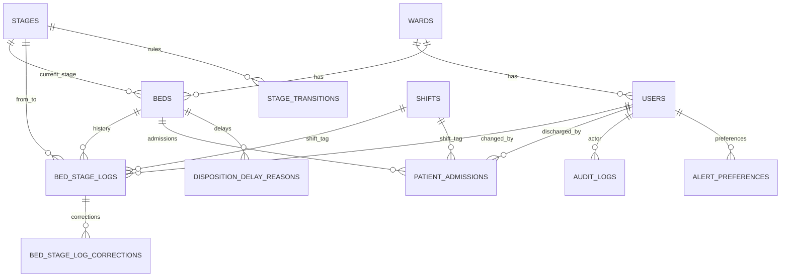

# Easy Database Schema (EWTCS)

This document explains the project database in plain language.

Source used:
- SQL migrations in `migrations/` (001 through 046)
- Timestamp JS migrations in `migrations/` (`1740649700000`, `1771680144644`, `1773770454739`)
- Existing reference doc `docs/data-model.md`

## 1) Big Picture

The database is organized into these areas:

1. Core patient flow and bed tracking
2. Users, authentication, and security
3. Audit/compliance and reporting
4. System configuration
5. Data retention and archive
6. OT room tracking

## 2) Core Tables (Most Important)

### `users`
Who can log in and what they can do.
- Key fields: `id`, `username`, `role`, `ward_id`, `is_active`
- Security fields: lockout counters, temporary password flags
- New privacy fields: encrypted email/name columns

### `wards`
Hospital ward master table.
- Key fields: `id`, `name`, `code`, `is_active`

### `stages`
Workflow stages a bed can move through.
- Key fields: `id`, `name`, `display_order`, `is_active`
- Used by both live bed state and transition history

### `beds`
Current live state of each bed.
- Key fields: `id`, `bed_number`, `current_stage_id`, `ward_id`, `is_occupied`
- Capacity fields: `is_temporary`, `is_virtual`
- Triage/patient snapshot fields: `patient_name`, `patient_uhid`, `key_symptom`, `triage_category`

### `bed_stage_logs`
Immutable history of all stage transitions.
- Key fields: `id`, `bed_id`, `from_stage_id`, `to_stage_id`, `changed_by_user_id`, `transition_time`
- Operational fields: `duration_in_previous_stage_ms`, `shift_id`
- Design rule: append-only (updates/deletes are blocked by triggers)

### `patient_admissions`
One row per completed admission/discharge cycle.
- Key fields: `id`, `bed_id`, `admitted_at`, `discharged_at`, `total_duration_ms`, `discharged_by_user_id`
- Includes TAT and encrypted patient payload columns

### `stage_transitions`
Defines which stage-to-stage moves are allowed.
- Key fields: `from_stage_id`, `to_stage_id`, `is_allowed`, `requires_supervisor_override`
- Enforces workflow rules centrally

### `disposition_delay_reasons`
Captures delay reasons at disposition points.
- Key fields: `bed_id`, `reason`, `recorded_by_user_id`, `recorded_at`, `resolved_at`
- Optional link to `bed_stage_logs`

### `shifts`
Shift definitions for time-based analytics.
- Key fields: `id`, `name`, `start_time`, `end_time`, `is_active`

## 3) Security and Auth Tables

### `token_blacklist`
Revoked JWT tokens.

### `kiosk_sessions`
Kiosk-bound sessions, including bound IP and disable controls.

### `alert_preferences`
Per-user notification preferences and threshold overrides.

## 4) Audit, Reporting, and Operations Tables

### `audit_logs`
Generic immutable audit trail.
- Tracks action type, entity, actor, changes, metadata, IP/encrypted fields

### `daily_summaries`
Daily aggregate metrics and AI summary workflow.
- Includes review and publication status (`draft`, `published`, `rejected`)

### `report_signoffs`
Supervisor signoff records for reports, including supersession chain.

### `error_events`
System error monitoring records (`WARN`, `ERROR`, `CRITICAL`).

### `user_feedback`
In-app feedback with category and optional rating.

## 5) Configuration Tables

### `system_settings`
Global key-value configuration.
- Examples: delay thresholds, archival retention, escalation threshold

### `stage_delay_thresholds`
Per-stage threshold override (`stage_id` -> threshold minutes).

### `delay_reason_options`
Admin-configurable delay reason picklist.

### `bed_stage_log_corrections`
Correction audit records linked to immutable stage logs.

## 6) Retention and Archive Tables

### Live-to-archive flow
Old live data is moved into archive tables by archival jobs.

### Archive tables
- `patient_admissions_archive`
- `audit_logs_archive`
- `bed_stage_logs_archive`
- `archival_runs` (job tracking and status)

Notes:
- Archive tables intentionally avoid strict FK coupling.
- `archival_runs` tracks status, cutoff, row counts, and failures.

## 7) OT Table

### `ot_rooms`
Operating theatre room availability.
- Key fields: `room_number`, `status`, `started_at`, `updated_by`
- Seeded room numbers: OT-01 to OT-16

## 8) Relationship Cheat Sheet

- One `ward` has many `users`
- One `ward` has many `beds`
- One `stage` can be the current stage of many `beds`
- One `bed` has many `bed_stage_logs`
- One `bed` has many `patient_admissions`
- One `user` creates many `bed_stage_logs`
- One `user` can create many `audit_logs`
- One `stage` has many `stage_transitions` (as source/target)
- One `shift` is referenced by many logs/admissions
- One `user` has one `alert_preferences` row (logical 1:1)

## 9) Simple ER Diagram

## 10) Important Migration Notes

1. There are duplicate migration numbers (`015`, `038`, `040`) with different files.
2. `stage_transitions` was rebuilt later (`037_fix_stage_transitions.sql`) to normalize rules.
3. Encryption support was added via new columns (040-044), but rollout is phased (mixed plain/encrypted fields can coexist).
4. Latest JS migration adds triage columns to `beds`.

## 11) Final Table Inventory (Current Expected State)

Core domain:
- `users`, `wards`, `beds`, `stages`, `bed_stage_logs`, `patient_admissions`, `stage_transitions`, `disposition_delay_reasons`, `shifts`

Security/operations:
- `token_blacklist`, `kiosk_sessions`, `alert_preferences`, `audit_logs`, `daily_summaries`, `report_signoffs`, `error_events`, `user_feedback`, `ot_rooms`

Config/retention:
- `system_settings`, `stage_delay_thresholds`, `delay_reason_options`, `bed_stage_log_corrections`, `patient_admissions_archive`, `audit_logs_archive`, `bed_stage_logs_archive`, `archival_runs`
