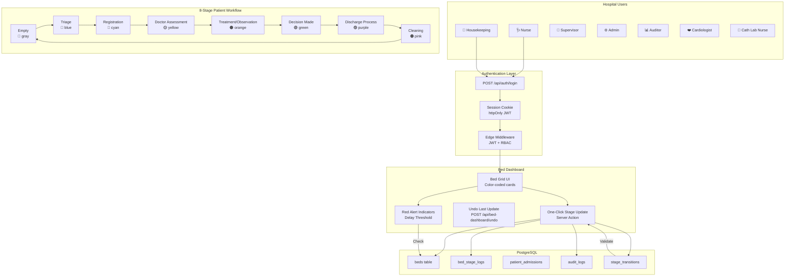
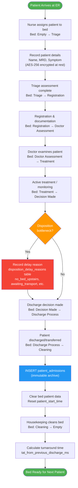
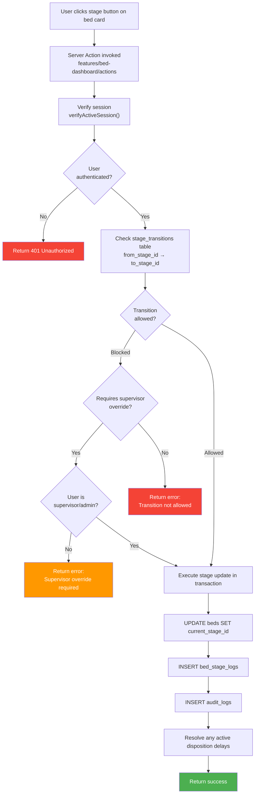
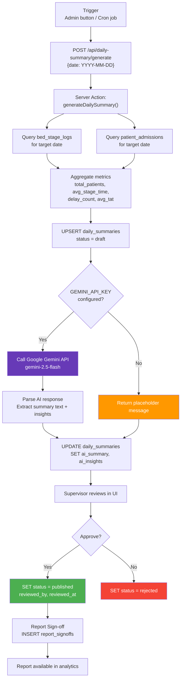
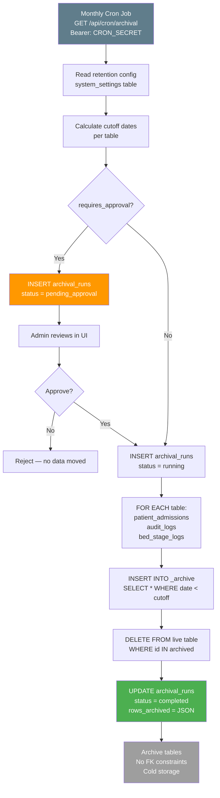
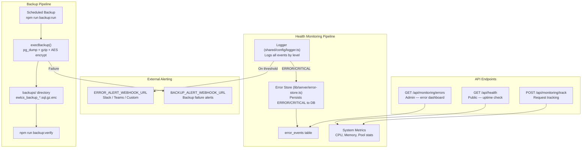
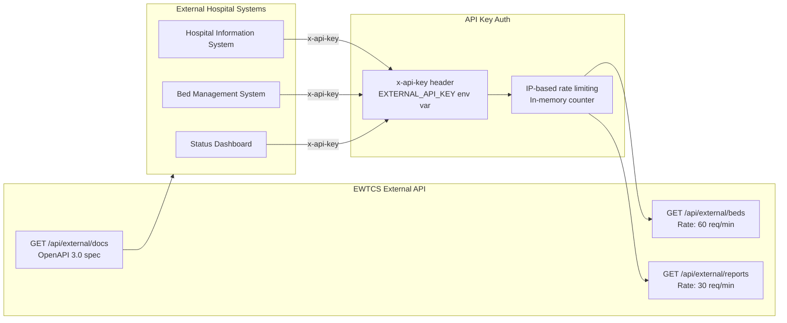
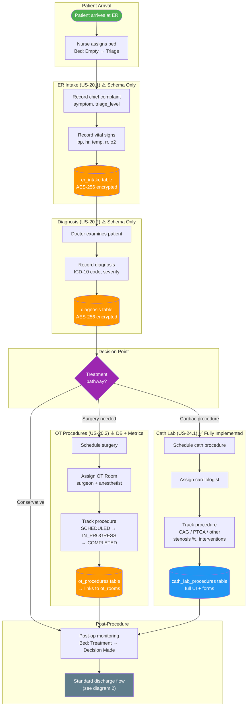

# EWTCS — Data Flow Diagrams

---

## 1. Core System Operations Flow

---

## 2. Patient Admission → Discharge Flow

---

## 3. Stage Update Validation Flow

---

## 4. AI Daily Summary Generation Flow

---

## 5. Data Archival Flow

---

## 6. System Health & Monitoring Flow

---

## 7. External Integration Flow

---

## 8. Department Module Flow (EPIC 20)

