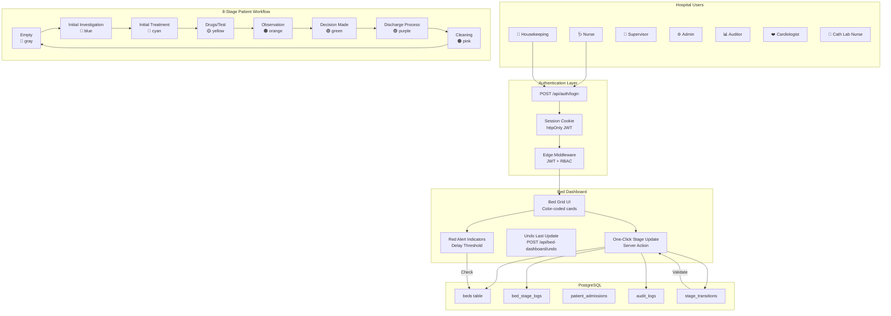
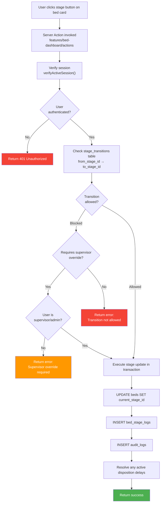
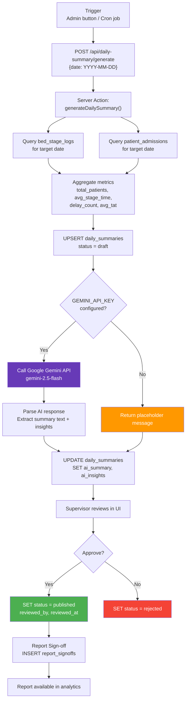

# EWTCS — Data Flow Diagrams

---
## 1. Core System Operations Flow

---
## 2. Patient Admission → Discharge Flow

```mermaid
flowchart TD
    Start(["Patient Arrives at ER"])
    A["Nurse assigns patient to bed<br/>Bed: Empty → Initial Investigation"]
    B["Record patient details<br/>Name, MRD, Symptom<br/>(AES-256 encrypted at rest)"]
    C["Initial assessment & investigations ordered<br/>Bed: Initial Investigation → Initial Treatment"]
    D["First-line treatment administered<br/>Bed: Initial Treatment → Drugs/Test"]
    E["Awaiting medication response/diagnostic tests<br/>Bed: Drugs/Test → Observation"]
    F["Observation & active clinical monitoring<br/>Bed: Observation → Decision Made"]
    G{"Disposition<br/>bottleneck?"}
    G1["Record delay reason<br/>disposition_delay_reasons table<br/>no_bed_upstairs, awaiting_transport, etc."]
    H["Discharge decision made<br/>Bed: Decision Made → Discharge Process"]
    I["Patient discharged/transferred<br/>Bed: Discharge Process → Cleaning"]
    J["INSERT patient_admissions<br/>(immutable archive)"]
    K["Clear bed patient data<br/>Reset patient_start_time"]
    L["Housekeeping cleans bed<br/>Bed: Cleaning → Empty"]
    M["Calculate turnaround time<br/>tat_from_previous_discharge_ms"]
    End(["Bed Ready for Next Patient"])

    Start --> A
    A --> B
    B --> C
    C --> D
    D --> E
    E --> F
    F --> G
    G -->|Yes| G1
    G1 --> H
    G -->|No| H
    H --> I
    I --> J
    J --> K
    K --> L
    L --> M
    M --> End

    style Start fill:#4CAF50,color:#fff
    style End fill:#4CAF50,color:#fff
    style G fill:#FF9800,color:#fff
    style G1 fill:#f44336,color:#fff
    style J fill:#2196F3,color:#fff
```

---
## 3. Stage Update Validation Flow

---
## 4. AI Daily Summary Generation Flow

---
## 5. Archival, Monitoring, External & Department Module Flows
> Diagrams for data archival, system health monitoring, external hospital system integration,
> and EPIC 20 department module flows are documented in
> **[DATA_FLOW_SUPPLEMENTAL.md](./DATA_FLOW_SUPPLEMENTAL.md)**.
