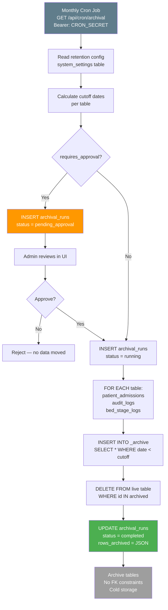
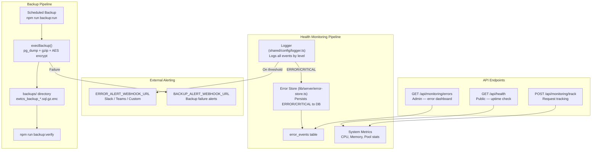
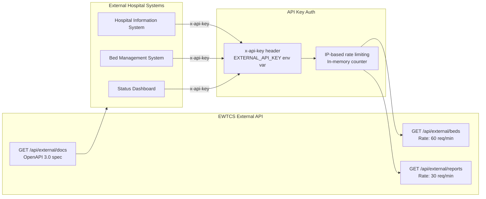
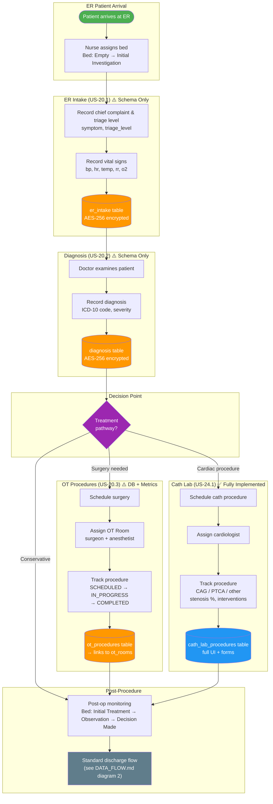

# EWTCS — Data Flow: Archival, Monitoring, External & Department Modules

> This document is part 2 of the Data Flow diagrams. See [DATA_FLOW.md](./DATA_FLOW.md) for the core operations, patient admission, stage update validation, and AI summary generation flows.

---

## 5. Data Archival Flow

---

## 6. System Health & Monitoring Flow

---

## 7. External Integration Flow

---

## 8. Department Module Flow (EPIC 20)

