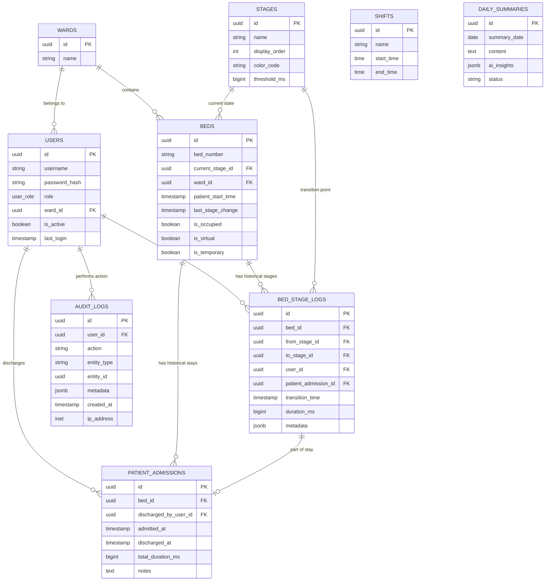

# Data Model Documentation

This document describes the database schema and data relationships for the EWTCS project. The schema is designed for high auditability, real-time performance, and structured analytics.

## 🏗️ Entity Relationship Diagram

---

## 📋 Core Tables

### `users`
Stores system accounts and credentials.
- `role`: Enum (`nurse`, `supervisor`, `admin`, `housekeeping`, `auditor`).
- `ward_id`: Links user to a specific hospital ward (US-6.3).

### `beds`
The living state of all monitorable beds.
- `current_stage_id`: Points to the current stage in the 8-stage workflow.
- `patient_start_time`: Reset on discharge, used to calculate total length of stay (LoS).
- `is_virtual`: True if the bed is not a physical unit but part of surge capacity.

### `bed_stage_logs`
The source of truth for all historical movement.
- **Immutability**: Once a log is closed (recorded with duration), it is structurally immutable.
- `duration_ms`: Calculated server-side at the next transition to ensure sub-millisecond accuracy.

### `patient_admissions`
Archival table for completed patient stays.
- Created atomically when a bed is discharged.
- Stores total LoS and notes for long-term analytics.

---

## ⚡ Performance Optimizations

### Indexes
- **Search**: `idx_users_username` and `idx_beds_bed_number` for instant lookup.
- **Real-time**: `idx_beds_occupied` and `idx_beds_stage` to power the dashboard filter bar.
- **Analytics**: `idx_bed_logs_transition_time` and `idx_patient_admissions_discharged_at` (DESC) for fast historical reporting and AI summaries.

### Constraints
- **Foreign Keys**: Enforced at the DB level to prevent orphaned logs or data corruption.
- **Uniqueness**: `bed_number` and `username` have unique constraints to prevent duplication.
- **Audit Triggers**: Some tables include immutability triggers (e.g., `audit_logs`) to prevent tampering after-the-fact.
